# Simulate Sight: COD with Multi-Stream Attention Network

**When flaws become features: Exploiting color-blind and sunglasses simulation for camouflaged object detection. "Defective" visual perspectives can reveal what normal vision hides.**

## Project Overview

**Camouflaged Object Detection (COD)** is challenging because foreground and background share similar colors, textures, and shapes. Traditional methods struggle due to extremely subtle visual differences.

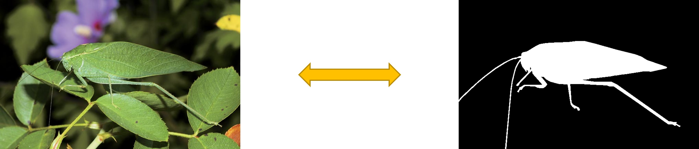

*Figure: Camouflaged object detection task - the insect blends seamlessly with the leaf, making it difficult to distinguish from the background.*

This repository implements a novel approach for COD by exploiting **color-blind** and **sunglasses** simulations as complementary views. Unlike traditional methods that rely solely on RGB images, our approach transforms "defective" visual perspectives into powerful feature enhancement techniques.

**Key insight**: Color-blind and sunglasses simulations actively suppress misleading color cues while **enhancing reliable structural information** (texture and edges)—precisely the cues that remain reliable in camouflage scenes.

|              Model               |        Strategy         | Training Input |  Test Input   |
| :------------------------------: | :---------------------: | :------------: | :-----------: |
|          Single-stream           | Improved Dual Attention |      RGB       |      RGB      |
|           Dual-stream            |  Improved Dual Fusion   |    RGB + CB    |   RGB + CB    |
|      Triple-stream (Direct)      |    Symmetric Fusion     | RGB + CB + SL  | RGB + CB + SL |
| **Triple-stream (Hierarchical)** |    Asymmetric Fusion    | RGB + CB + SL  | RGB + CB + SL |

Among them:

| Symbol |      Significance      |   Information Content    |            Role in COD             |
| :----: | :--------------------: | :----------------------: | :--------------------------------: |
|  RGB   |  Normal visual image   | Complete color + texture |           Baseline input           |
|   CB   | Color-blind simulation |   Texture + luminance    | Suppresses color, enhances texture |
|   SL   | Sunglasses simulation  |     Edge + structure     | Enhances boundaries, reduces glare |

## Architecture

### Backbone: Res2Net-50

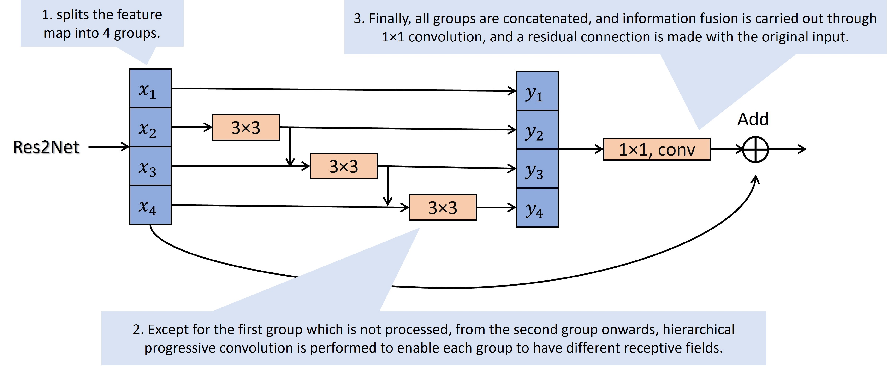

*Figure: Res2Net multi-scale receptive field design. The feature map is split into 4 groups, with hierarchical progressive convolution enabling different receptive fields across groups.*

Res2Net improves upon standard ResNet by:

1. Splitting feature maps into 4 groups.
2. Hierarchical progressive convolution for different receptive fields.
3. Multi-scale fusion via 1×1 convolution with residual connection.

### Model Variants

#### 1. Single-stream

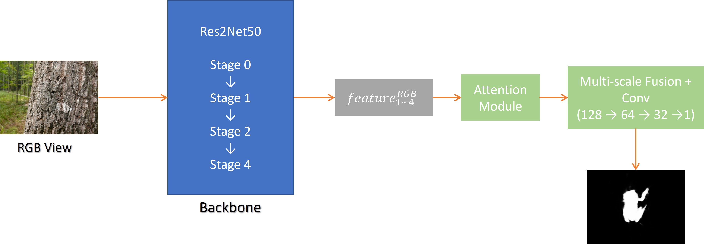

*Figure: Single-stream architecture. Only the original RGB image is processed through the backbone and attention modules.*

#### 2. Dual-stream

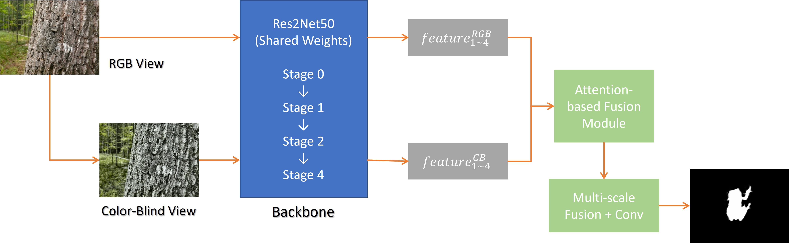

*Figure: Dual-stream architecture. RGB and color-blind simulated images are processed in parallel with shared backbone weights, then fused via attention-based fusion modules.*

#### 3. Triple-stream (Direct)

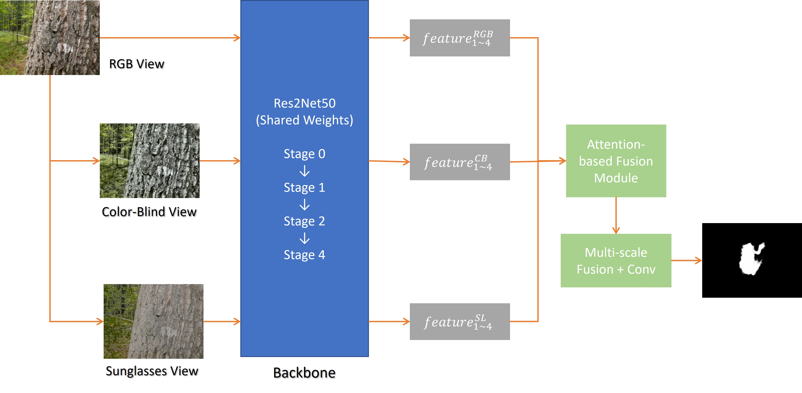

*Figure: Triple-stream direct fusion architecture. All three views (RGB, color-blind, sunglasses) are processed symmetrically and fused with equal importance.*

#### 4. Triple-stream (Hierarchical)

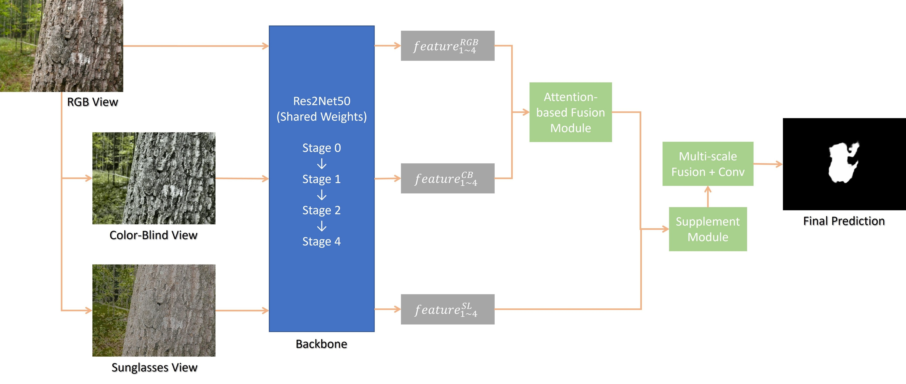

*Figure: Hierarchical triple-stream fusion architecture (recommended). RGB and color-blind views are first fused, then supplemented with the sunglasses view, respecting the complementary nature of each stream.*

## Technical Details

### Color-blind Simulation (Deuteranopia) Pipeline

1. **LMS transformation**: Convert RGB to cone response space.

2. **Vischeck projection**: Simulate deuteranopia (green-blind)
   $$
   \mathbf{M}_{deutan} = \begin{bmatrix} 0.2920 & 0.7050 & 0.0000 \\ 0.2920 & 0.7050 & 0.0000 \\ -0.0210 & 0.0300 & 1.0000 \end{bmatrix}
   $$

3. **Texture enhancement**:

   - CLAHE (Contrast Limited Adaptive Histogram Equalization).
   - Multi-scale texture amplification (Laplacian + Sobel).

### Sunglasses Simulation Pipeline

1. **Brightness reduction**: Scale to 60% in HSV space.
2. **Glare suppression**: Adaptive threshold (0.85) with 70% reduction.
3. **Saturation boost**: Scale S-channel by 1.3x.
4. **Multi-scale edge enhancement**: Canny at (30,80), (50,150), (70,200).

### Loss Function

Composite loss combining Binary Cross-Entropy (BCE) and Intersection over Union (IoU):

$$
\mathcal{L}_{main} = \alpha \cdot \mathcal{L}_{BCE} + \beta \cdot \mathcal{L}_{IoU}
$$

with $\alpha = 0.7$, $\beta = 0.3$.

For multi-stream models, auxiliary loss is added:

$$
\mathcal{L}_{total} = \mathcal{L}_{main} + \lambda \cdot \mathcal{L}_{aux}
$$

with $\lambda = 0.3$.

## Evaluation Metrics

We report six complementary metrics following COD literature:

|  Metric   |                    Formula                     |                 Description                 |        Range         |
| :-------: | :--------------------------------------------: | :-----------------------------------------: | :------------------: |
|  **MAE**  |            $\frac{1}{N}\sum\|P-G\|$            |  Mean Absolute Error (pixel-wise accuracy)  | 0 (best) - 1 (worst) |
|  **Sm**   |    $\alpha \cdot S_o + (1-\alpha)\cdot S_r$    |  Structure Measure (structural similarity)  | 0 (worst) - 1 (best) |
|  **wFm**  | $\frac{(1+\beta^2)P_w R_w}{\beta^2 P_w + R_w}$ |     Weighted F-measure (region quality)     | 0 (worst) - 1 (best) |
| **adpFm** |  Adaptive threshold $T=2\cdot\text{mean}(P)$   |  Adaptive F-measure (per-image threshold)   | 0 (worst) - 1 (best) |
| **adpEm** |  $\frac{1}{4}(1+x)^2$ on binarized prediction  |   Adaptive E-measure (enhanced alignment)   | 0 (worst) - 1 (best) |
| **maxFm** |            $\max_{t\in[0,1]} F(t)$             | Maximum F-measure (best possible threshold) | 0 (worst) - 1 (best) |

## Project Structure

```
SimulateSight/
├── checkpoints/            # Checkpoints files
│   ├── res2net50_v1b_26w_4s-3cf99910.pth
├── config/                 # Configuration files
│   ├── single_stream.py
│   ├── dual_stream.py
│   ├── triple_stream.py
│   └── __init__.py
├── dataset/               # Dataset handling
│   ├── datasets.py        # Single/Dual/Triple stream datasets
│   ├── transforms.py      # Data augmentation
│   └── __init__.py
├── lib/
│   ├── Res2Net_v1b.py
│   └── __init__.py
├── models/                # Model definitions
│   ├── backbone.py        # Res2Net-50 backbone
│   ├── single_attention.py
│   ├── dual_fusion.py
│   ├── triple_fusion.py
│   ├── decoders.py
│   ├── models.py
│   └── __init__.py
├── train/                 # Training utilities
│   ├── loss.py
│   ├── trainer.py
│   ├── validator.py
│   ├── indicators.py
│   ├── checkpoints.py
│   └── __init__.py
├── utils/                 # Helper utilities
│   ├── scheduler.py
│   ├── visualizer.py
│   ├── complementarity.py
│   ├── utils.py
│   ├── lru_cache.py
│   └── __init__.py
├── generator.py           # Data generation for CB/SL views
├── train_single.py        # Train single-stream model
├── train_dual.py          # Train dual-stream model
├── train_triple.py        # Train triple-stream model
├── test.py                # Evaluate model on test sets
├── predict.py             # Predict on custom images
├── generator.sh           # Data generation script
└── data/                  # Dataset directory
    ├── Train/
    │   ├── Imgs/
    │   ├── GT/
    │   ├── Imgs_CB/       # Color-blind simulated
    │   ├── Imgs_SL/       # Sunglasses simulated
    │   └── GT_Edge/       # Edge maps
    ├── Val/
    │   ├── Imgs/
    │   ├── GT/
    │   ├── Imgs_CB/
    │   ├── Imgs_SL/
    │   └── GT_Edge/
    └── Test/
        ├── CAMO/
        │   ├── Imgs/
        │   ├── GT/
        │   ├── Imgs_CB/
        │   ├── Imgs_SL/
        │   └── Edge/
        ├── CHAMELEON/
        ├── COD10K/
        └── NC4K/
```

## Quick Start

### Environment Setup

```bash
# 1. Clone the repository
git clone https://github.com/elowendeng/SimulateSight.git
cd SimulateSight

# 2. Create conda environment
conda create -n ss_cod python=3.8 -y
conda activate ss_cod

# 3. Install PyTorch (CUDA 11.8)
pip install torch torchvision torchaudio --index-url https://download.pytorch.org/whl/cu118

# 4. Install dependencies
pip install -r requirements.txt
```

The command to install PyTorch can be found on the webpage: [Get Started](https://pytorch.org/get-started/locally/). Before that, you need to run the command: `nvcc --version` to check the CUDA version.

### Data Preparation

Download the following datasets:

- [COD10K](https://drive.google.com/file/d/1M8-Ivd33KslvyehLK9_IUBGJ_Kf52bWG/view) (Training set: 3040 images).
- [CAMO](https://drive.google.com/file/d/1M8-Ivd33KslvyehLK9_IUBGJ_Kf52bWG/view) (Validation set: 1000 images).
- [Test sets](https://drive.google.com/file/d/1V0iSEdYJrT0Y_DHZfVGMg6TySFRNTy4o/view) (CAMO-Test, CHAMELEON, COD10K-Test, NC4K).

Organize them as:

```
data/
├── Train/          # COD10K training set
├── Val/            # CAMO training set
└── Test/
    ├── CAMO/
    ├── CHAMELEON/
    ├── COD10K/
    └── NC4K/
```

Download the Res2Net weights:

- [res2net50_v1b_26w_4s-3cf99910.pth](https://drive.google.com/file/d/1QumnqSY_2wa-81-Ti0X1-jQzaGDIfa9r/view)

Organize them as:

```
checkpoints/
└── res2net50_v1b_26w_4s-3cf99910.pth
```

> Data source credit: [SINet-V2 - Concealed Object Detection (IEEE TPAMI)](https://github.com/GewelsJI/SINet-V2).

### Generate Augmented Views

**Recommended: Use the shell script**

```bash
chmod +x generator.sh
./generator.sh
```

**Or run manually:**

```bash
# Generate for training set
python generator.py -p ./data/Train

# Generate for validation set
python generator.py -p ./data/Val

# Generate for test sets (skip edge GT)
python generator.py -p ./data/Test/CAMO --skip-edge
python generator.py -p ./data/Test/CHAMELEON --skip-edge
python generator.py -p ./data/Test/COD10K --skip-edge
python generator.py -p ./data/Test/NC4K --skip-edge
```

### Training

```bash
# Single-stream model (RGB only)
# --attn_type ['spatial', 'channel', 'dual', 'multi', 'none']
python train_single.py --attn_type dual

# Dual-stream model (RGB + Color-blind)
# --attn_type ['spatial', 'channel', 'dual', 'multi', 'none']
python train_dual.py --attn_type dual

# Triple-stream model (RGB + Color-blind + Sunglasses)
# --fusion_type ['direct', 'hierarchical', 'gated', 'residual']
# Direct fusion
python train_triple.py --fusion_type direct

# Hierarchical fusion (recommended)
python train_triple.py --fusion_type hierarchical
```

Training generates:

- `checkpoints/{model_name}/best_model.pth` - Best model checkpoint.
- `checkpoints/{model_name}/checkpoint_latest.pth` - Latest checkpoint.
- `checkpoints/{model_name}/training_curves.png` - Training curves.
- `checkpoints/{model_name}/training_data.npy` - Training history.
- `checkpoints/{model_name}/best_metrics.txt` - Evaluation metrics of the best model.

### Evaluation

Test a trained model on all benchmark datasets:

```bash
# Single-stream
python test.py -p single_dual

# Dual-stream
python test.py -p dual_dual

# Triple-stream direct
python test.py -p triple_direct

# Triple-stream hierarchical
python test.py -p triple_hierarchical
```

This evaluates on CAMO, CHAMELEON, COD10K, and NC4K, saving results to `results/{checkpoint_dir}/test_results.txt`.

### Inference on Custom Images

```bash
# Single-stream
python predict.py -p single_dual -i /path/to/images -o ./results

# Dual-stream (requires CB images)
python predict.py -p dual_dual -i /path/to/images --cb_dir /path/to/cb -o ./results

# Triple-stream (requires CB and SL images)
python predict.py -p triple_hierarchical -i /path/to/images --cb_dir /path/to/cb --sl_dir /path/to/sl -o ./results
```

> **Note**: `cb` and `sl` are the green-blind simulation images and sunglasses simulation images corresponding to the original images.

## Detailed Results

### Quantitative Results

**Validation Set Performance** (CAMO training set, 1000 images):

| Model                            | Best Epoch |   MAE ↓    |    Sm ↑    |   wFm ↑    |  adpFm ↑   |  adpEm ↑   |  maxFm ↑   |
| :------------------------------- | :--------: | :--------: | :--------: | :--------: | :--------: | :--------: | :--------: |
| Single-stream                    |     83     |   0.0688   |   0.7954   |   0.6827   |   0.7475   |   0.8639   |   0.8050   |
| Dual-stream                      |     96     |   0.0628   |   0.8058   |   0.7187   |   0.7635   |   0.8798   |   0.8135   |
| Triple-stream (Direct)           |    109     |   0.0641   |   0.8068   |   0.7079   |   0.7662   |   0.8811   | **0.8191** |
| **Triple-stream (Hierarchical)** |    119     | **0.0605** | **0.8102** | **0.7258** | **0.7720** | **0.8832** |   0.8157   |

**Average Performance on Four Test Sets** (CAMO, CHAMELEON, COD10K, NC4K):

| Model                            |   MAE ↓    |    Sm ↑    |   wFm ↑    |  adpFm ↑   |  adpEm ↑   |  maxFm ↑   |
| :------------------------------- | :--------: | :--------: | :--------: | :--------: | :--------: | :--------: |
| Single-stream                    |   0.0629   |   0.7978   |   0.6643   |   0.7240   |   0.8638   |   0.7856   |
| Dual-stream                      |   0.0576   |   0.8054   |   0.6942   |   0.7364   |   0.8712   |   0.7906   |
| Triple-stream (Direct)           |   0.0587   |   0.8049   |   0.6818   |   0.7409   |   0.8725   | **0.7946** |
| **Triple-stream (Hierarchical)** | **0.0556** | **0.8072** | **0.7012** | **0.7453** | **0.8808** |   0.7937   |

> **Key finding**: Triple-stream hierarchical model reduces MAE by **11.6%** compared to single-stream baseline!

### Per-dataset Performance

| Dataset                     |   MAE ↓    |    Sm ↑    |   wFm ↑    |  adpFm ↑   |  adpEm ↑   |  maxFm ↑   |
| :-------------------------- | :--------: | :--------: | :--------: | :--------: | :--------: | :--------: |
| **CAMO** (most challenging) |            |            |            |            |            |            |
| Single-stream               |   0.1143   |   0.6979   |   0.5381   |   0.6309   |   0.7640   |   0.7014   |
| Triple-stream (Hier.)       | **0.1020** | **0.7202** | **0.5937** | **0.6734** | **0.8029** | **0.7244** |
| **CHAMELEON**               |            |            |            |            |            |            |
| Single-stream               |   0.0389   |   0.8674   |   0.7613   |   0.8052   |   0.9262   |   0.8499   |
| Triple-stream (Hier.)       | **0.0352** |   0.8674   | **0.7831** | **0.8165** | **0.9373** | **0.8502** |
| **COD10K**                  |            |            |            |            |            |            |
| Single-stream               |   0.0400   |   0.8033   |   0.6417   |   0.6880   |   0.8779   |   0.7627   |
| Triple-stream (Hier.)       | **0.0348** | **0.8070** | **0.6746** | **0.8165** | **0.8860** | **0.7657** |
| **NC4K**                    |            |            |            |            |            |            |
| Single-stream               |   0.0582   |   0.8227   |   0.7158   |   0.7718   |   0.8869   |   0.8285   |
| Triple-stream (Hier.)       | **0.0503** | **0.8340** | **0.7535** | **0.7875** | **0.8968** | **0.8346** |

### Qualitative Results

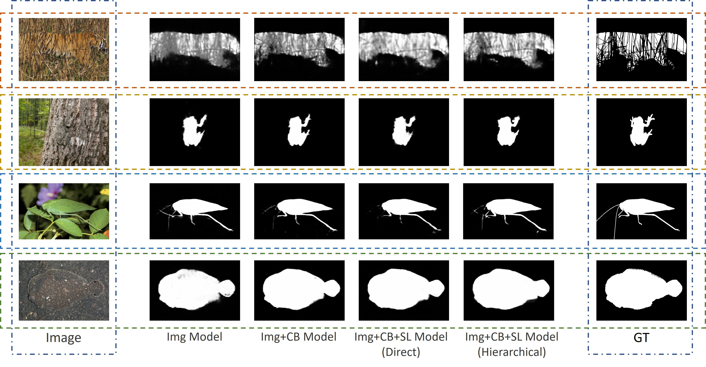

*Figure: Visual comparison of predictions across different models. From left to right: original image, ground truth, single-stream prediction, dual-stream prediction, triple-stream direct fusion prediction, and triple-stream hierarchical fusion prediction. Our hierarchical triple-stream model produces more accurate and complete segmentation, especially in challenging camouflage scenes.*

### Training Curves

#### 1. Single-stream

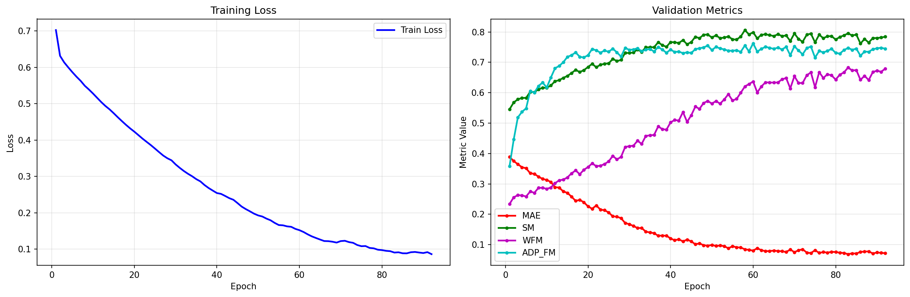

#### 2. Dual-stream

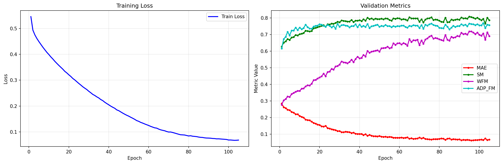

*Figure: Training curves for single-stream (left) and dual-stream (right) models. The dual-stream model shows faster convergence and lower final loss.*

#### 3. Triple-stream (Direct)

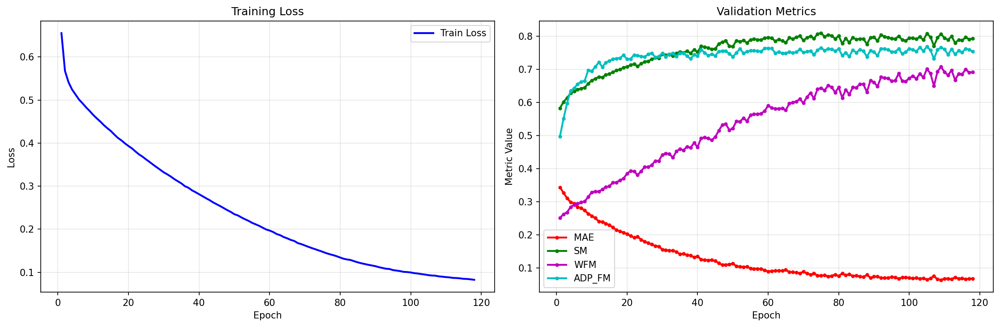

#### 4. Triple-stream (Hierarchical)

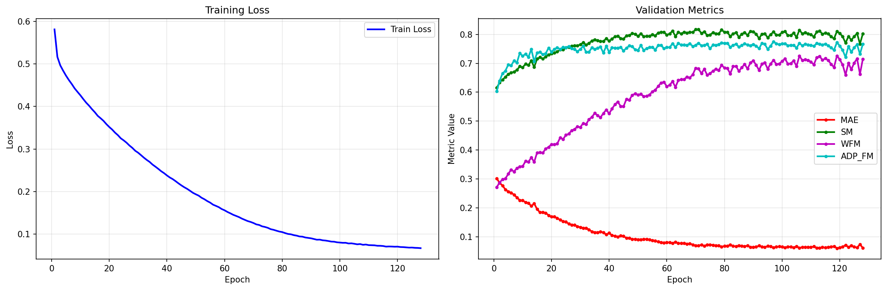

*Figure: Training curves for triple-stream direct fusion (left) and hierarchical fusion (right) models. The hierarchical model achieves better convergence with more stable validation metrics.*

## Key Insights

1. **"Defective" perspectives have information value**: Color-blind and sunglasses simulation views deviate from normal vision but expose texture and edge features of camouflaged targets.

2. **Multi-stream architecture is effective**: Dual-stream reduces MAE by 8.2% vs single-stream; triple-stream Hierarchical further reduces by 3.7%.

3. **Hierarchical fusion is optimal**: Asymmetric design (RGB-CB fusion first, then SL supplement) outperforms symmetric direct fusion.

4. **Significant improvement in complex scenarios**: On the most challenging CAMO dataset, triple-stream Hierarchical reduces MAE by 10.8% vs single-stream.

## License

This project is licensed under the MIT License - see the [LICENSE](LICENSE) file for details.

## Contact

Project Lead: Nan Deng ([cbhsfmf0206@gmail.com](mailto:cbhsfmf0206@gmail.com))

Project Link: [https://github.com/elowendeng/SimulateSight](https://github.com/elowendeng/SimulateSight)

## Acknowledgments

- [SINet-V2](https://github.com/GewelsJI/SINet-V2) - As a reference.

Appreciate for the assistance provided by the "2025-2-CISC7401-001 ADVANCED MACHINE LEARNING" course at the University of Macau!